# Getting Started

Requirements:

* https://www.postman.com/downloads/
* octobrowser account with at least *Base* subscription level

Public documentation is available here: https://documenter.getpostman.com/view/1801428/UVC6h6aR

### Create workspace

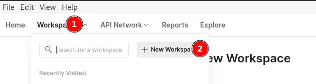

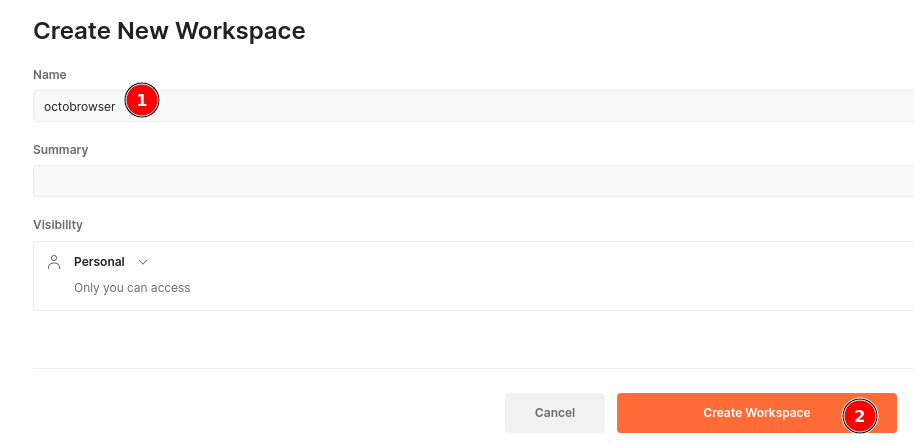

### Import postman collection and environment

Download files:

* [collection](postman/automation.postman_collection.json)
* [environment](postman/postman_environment.json)

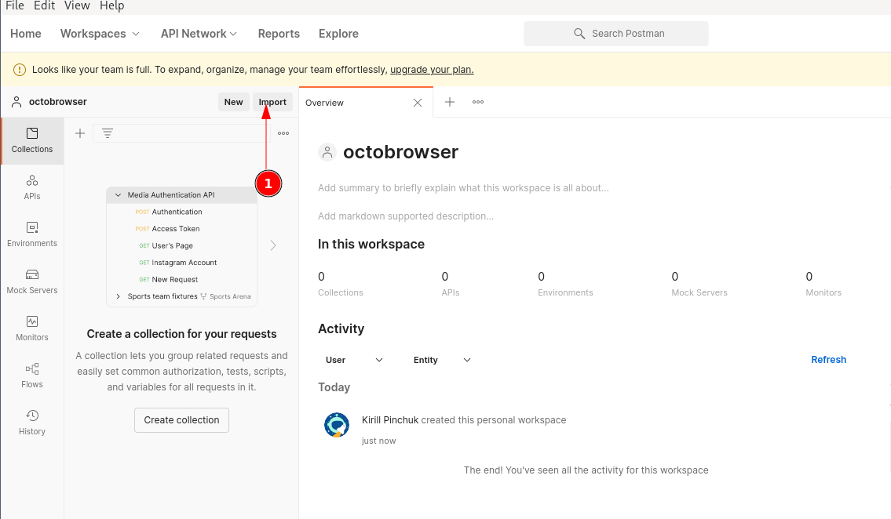

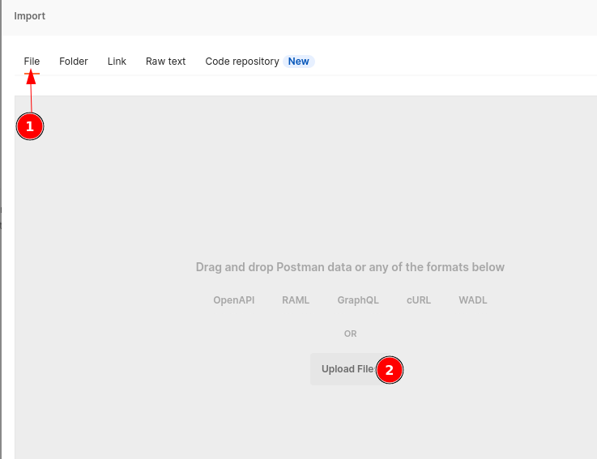

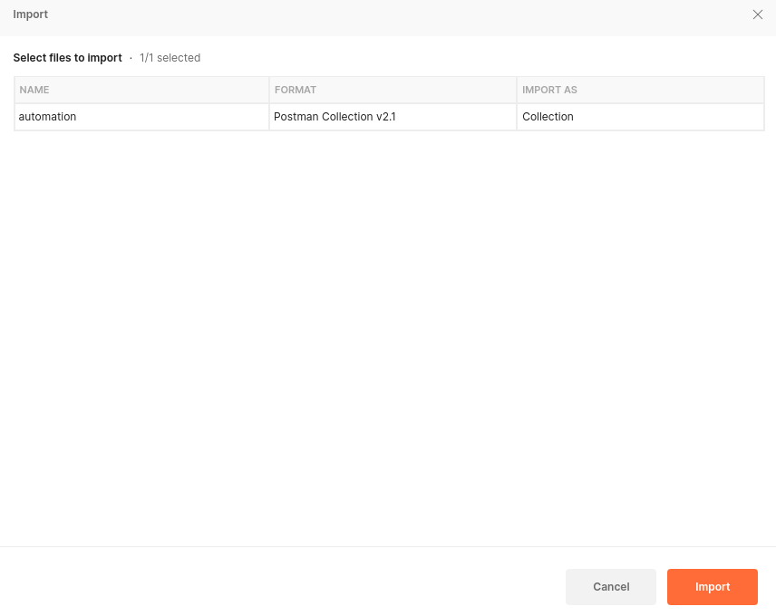

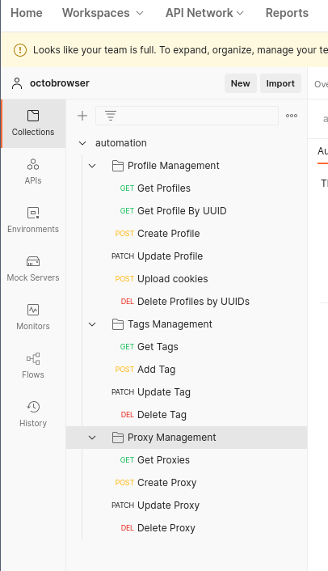

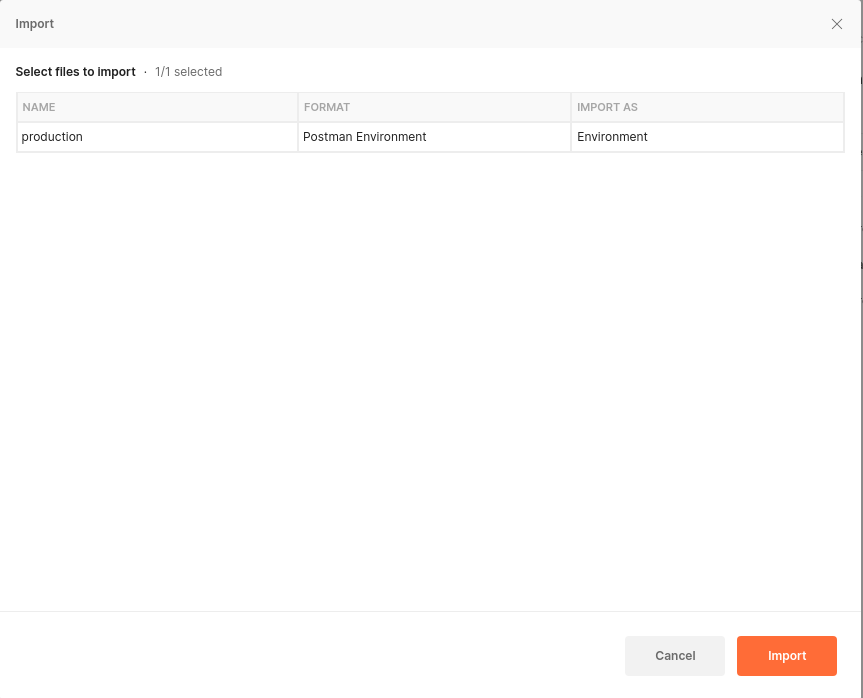

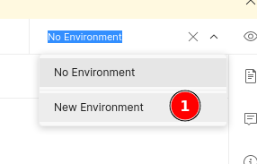

### Set API Token

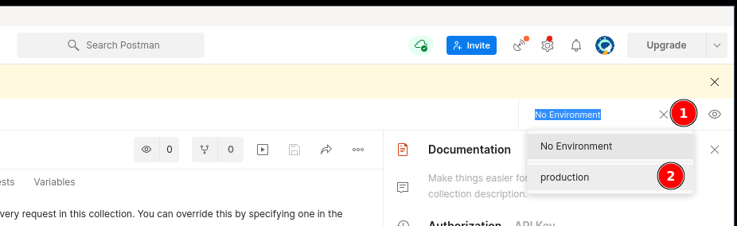

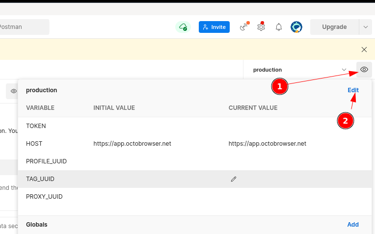

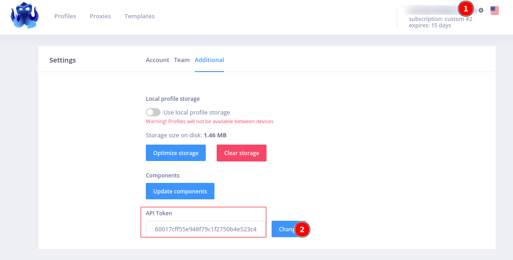

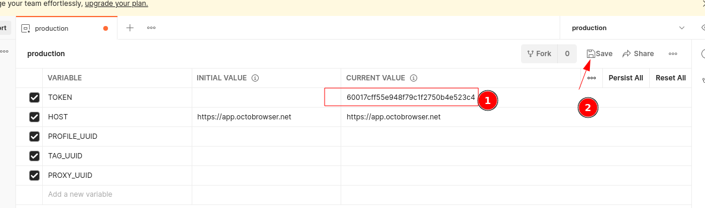

### Check that everything is ok

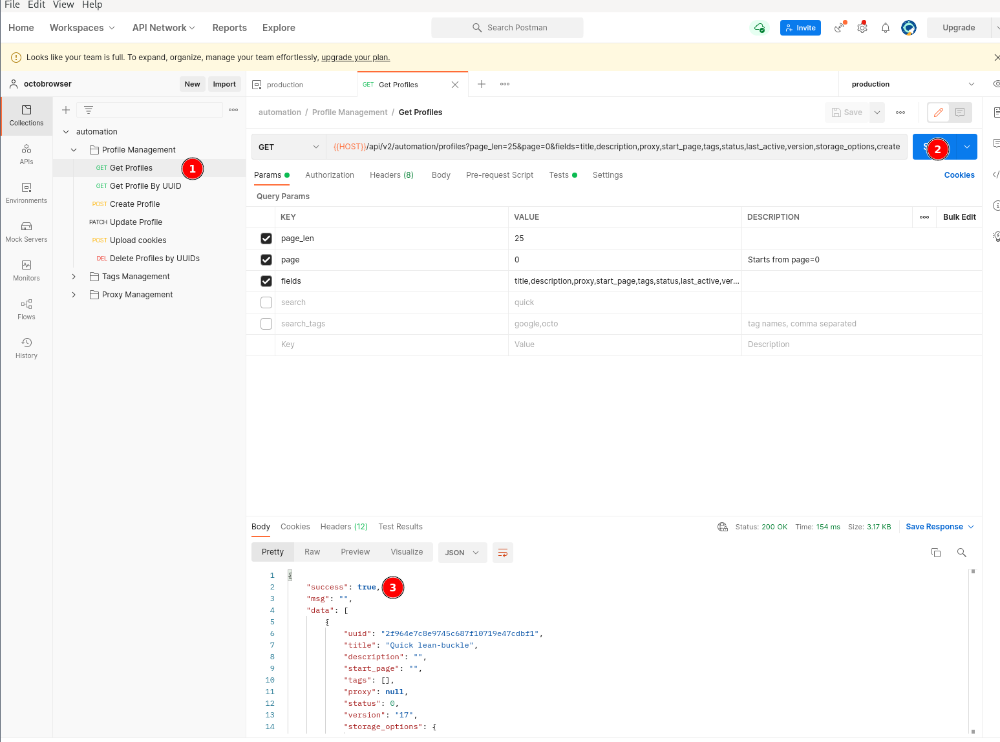

